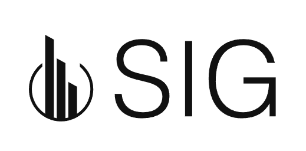

<br/>
<p align="center">
  <a href="https://github.com/jmtecera/SGI">
    
  </a>

  <h1 align="center">SGI</h3>

  <p align="center">
    <a href="https://github.com/jmtecera/SGI/wiki"><strong>Read the documentation »</strong></a>
    <br/>
    <br/>
    <a href="https://github.com/jmtecera/SGI/issues">Report Bug</a>
    ・
    <a href="https://github.com/jmtecera/SGI/issues">Request Feature</a>
  </p>
</p>

## About
SGI, required as a project in OOP lessons at FICH - UNL, adeptly manages property listings, client interactions, and administrative tasks with streamlined efficiency.

## Getting Started


### Prerequisites

Before you begin, ensure that you have the following installed on your system:

* [wxWidgets](https://www.wxwidgets.org)
* [CMake](https://cmake.org)
* [wxFormBuilder](https://github.com/wxFormBuilder/wxFormBuilder) [optional]

### Installation

1. Clone the repo (with SSH)

```
git clone git@github.com:jmtecera/SGI.git
```

## Usage

Download the latest release [here](https://github.com/jmtecera/SGI/releases).

To manually build, follow these steps:

   - Compile or download the required wxWidgets binaries and install them.
   - You can build the project using CMake and execute the program


## Contribution Guidelines

Your contributions are essential for enhancing the SGI project. We appreciate your commitment and value professionalism in our collaboration.

- **Suggestions:** Share your thoughts on projects by [opening an issue](https://github.com/jmtecera/SGI/issues/new) and propose changes via pull requests after editing the *README.md* file.

- **Quality Standards:** Ensure professionalism by checking for spelling and grammar errors in your contributions.

- **Pull Requests:** Create individual pull requests for each suggestion to streamline the review process.

- **Respectful Discussions:** Engage in open discussions through the issues section for any concerns or questions.

- **Code of Conduct:** Familiarize yourself with our [Code of Conduct](https://github.com/jmtecera/SGI/blob/main/CODE_OF_CONDUCT.md) before contributing.

## License

For more information, please refer to the [LICENSE](https://github.com/jmtecera/SGI/blob/main/LICENSE.md) file.